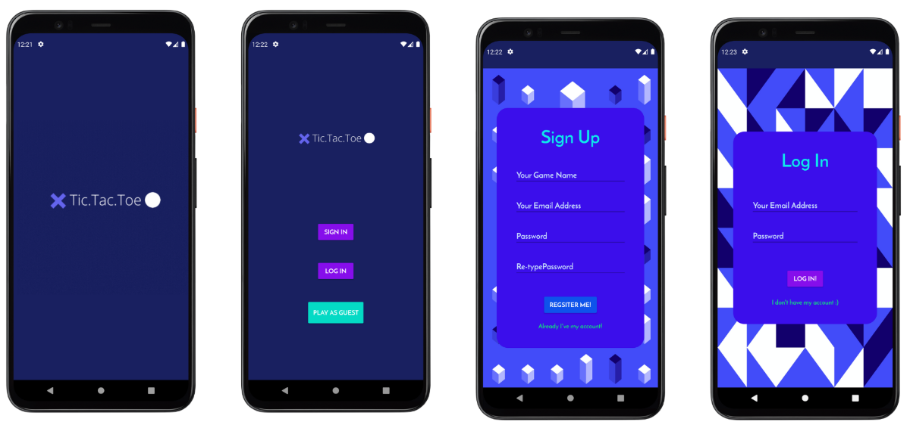
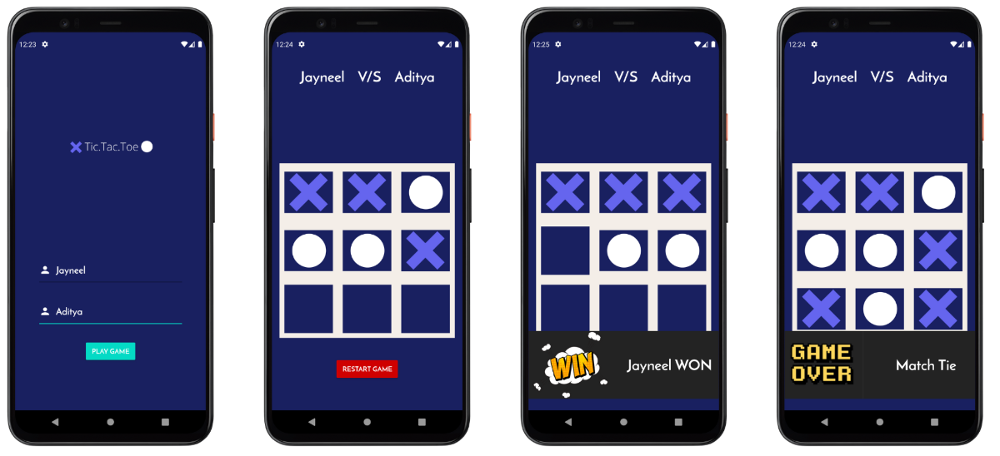

# Hacktober-TicTacToe
Hacktober Fest 2023

# Tic-Tac-Toe Game App


Welcome to our Tic-Tac-Toe game project! This app is built using native Java, XML, and an SQLite database. The core game logic relies on simple data structures like arrays, and we've used layout inflaters to create custom widgets.

If you're interested in contributing in or forking this repository, you'll find a straightforward yet engaging project that's perfect for learning and collaboration. We look forward to your contributions and hope you enjoy working on this classic game!

## Project Organization
The project comprises five distinct packages:

**auth** - This package handles user signup and login functionalities.

**dbhelper** - In this package, you'll find all SQLite-related operations.

**game** - This package oversees game-related activities and logic.

**home** - Responsible for navigation and the main home screen.

**splash** - This package takes care of the app's splash screen.


## Sneak Peak
 
 


## Project To-Do List

Welcome to our project's to-do list! Here's a set of potential features and tasks that contributors can work on to enhance the project:

- **String Externalization:** Replace hardcoded string values with a more maintainable approach by storing them in the `strings.xml` resource file.

- **Material Design Components:** Improve the user interface by substituting native components with Material Design components, enhancing the app's overall look and feel.

- **Input Validation:** Implement input validation within the "auth" package, including regex validation for email addresses and strengthening password validation to enhance security.

- **Layout Responsiveness:** Make the app's layouts responsive by replacing fixed dimensions with dynamic ones, ensuring a consistent user experience across different devices.

- **Sound Effects and Animations:** Add sound effects and animations to make the game more engaging and enjoyable for users.

- **Persistent Session:** Utilize shared preferences to enable a persistent session after a user logs in, enhancing user convenience.

- **Game Record Handling:** Manage game records effectively by recording and storing game outcomes in an SQLite database, allowing users to track their progress.

Contributors are encouraged to pick tasks from this list and make valuable contributions to our project.
## Installation and Adding your first PR:

- Fork this repo (button on top)
- Clone on your local machine

```terminal
git clone https://github.com/jayneeel/Hacktober-TicTacToe.git
```
- Navigate to project directory.
```terminal
cd <Directory Name>
```

- Create a new Branch

```markdown
git checkout -b my-new-branch
```
- Add your files
```markdown
git add <file names>
```
- Commit your changes.

```markdown
git commit -m "Summarize the changes you have done"
```
- Then push 
```markdown
git push origin my-new-branch
```


- Create a new pull request from your forked repository


